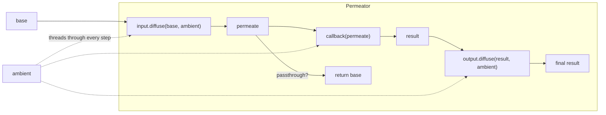

# @tsyche/membrane

Composable operation pipelines for managing data at
operation boundaries. Membranes sit between your business
logic and the outside world — enriching inputs, shaping
outputs, and protecting domain aggregates without
polluting the core data model.

Each membrane wraps an async callback that transforms data
according to a merge strategy (`overwrite`, `preserve`,
`append`, or `passthrough`). Membranes compose into
sequences, and a Permeator orchestrates the full
input → callback → output pipeline. Ambient context
(tenant, correlation ID, request metadata) threads through
every step without mutation.

Seven membrane types cover objects, arrays, scalars,
projections, proxies, streams, and sequenced chains.
All are stateless and async-first.



## Install

```bash
npm install @tsyche/membrane
# or
yarn add @tsyche/membrane
# or
pnpm add @tsyche/membrane
```

## Quick Start

```typescript
import { Membrane } from '@tsyche/membrane';

// Create membranes for input enrichment and output post-processing
const input = Membrane.object(
  async (base) => ({ ...base, timestamp: Date.now() }),
  'overwrite',
);
const output = Membrane.object(
  async (base) => ({ ...base, processed: true }),
  'overwrite',
);

// Wire them into a permeator
const permeator = Membrane.permeate(input, output);

const result = await permeator.permeate({ userId: '123' }, async (scoped) => {
  // scoped has { userId: '123', timestamp: ... }
  const user = await fetchUser(scoped.userId);
  return user;
});
// result has { ...user, processed: true }
```

## Concepts

- **Base** -- input data fed into a membrane
- **Permeate** -- callback-produced data merged with base
- **Diffuse** -- apply a membrane to base data
- **Ambient** -- per-call context (e.g. tenant, request metadata)
  threaded through the pipeline

## Membrane Types

### ObjectMembrane

Enriches base with callback-produced permeate data.
Supports `overwrite`, `preserve`, and `passthrough`
strategies.

```typescript
// overwrite: callback result replaces base
const membrane = Membrane.object(
  async (base) => ({ ...base, role: 'admin' }),
  'overwrite',
);
await membrane.diffuse({ name: 'Alice' });
// => { name: 'Alice', role: 'admin' }
```

```typescript
// preserve (default): base fields win on conflict
const membrane = Membrane.object(async (base) => ({
  ...base,
  name: 'ignored',
  extra: true,
}));
await membrane.diffuse({ name: 'Alice' });
// => { name: 'Alice', extra: true }
```

### CollectionMembrane

Handles arrays with `append`, `overwrite`, and
`passthrough` strategies.

```typescript
// append (default): concatenates callback result onto base
const membrane = Membrane.collection(async () => [{ id: 3 }]);
await membrane.diffuse([{ id: 1 }, { id: 2 }]);
// => [{ id: 1 }, { id: 2 }, { id: 3 }]
```

```typescript
// overwrite: replaces base array entirely
const membrane = Membrane.collection(async () => [{ id: 99 }], 'overwrite');
await membrane.diffuse([{ id: 1 }, { id: 2 }]);
// => [{ id: 99 }]
```

### ProjectionMembrane

Selects a subset from base (subtractive). Has a fixed
`strategy = 'passthrough'`, so the Permeator passes the
original base through unchanged.

```typescript
const membrane = Membrane.projection(async (base) => ({
  id: base.id,
  email: base.email,
}));
await membrane.diffuse({
  id: '1',
  name: 'Alice',
  email: 'alice@test.com',
  password: 'hash',
});
// => { id: '1', email: 'alice@test.com' }
```

### ProxyMembrane

Wraps permeate in a Proxy that falls back to base for
missing properties. Permeate shadows base on conflict.

```typescript
const membrane = Membrane.proxy(async () => ({ extra: true }));
const result = await membrane.diffuse({ name: 'Alice' });

result.name; // 'Alice' (from base)
result.extra; // true (from permeate)
'name' in result; // true
'extra' in result; // true
```

### ScalarMembrane

Handles primitives (string, number, boolean). Callback
produces the full replacement value. Defaults to
`passthrough` strategy.

```typescript
const membrane = Membrane.scalar(async (base: string) => base.toUpperCase());
await membrane.diffuse('hello');
// => 'HELLO'
```

### SequenceMembrane

Chains multiple membranes, piping each output as base
to the next.

```typescript
const first = Membrane.object(
  async (base) => ({ ...base, first: true }),
  'overwrite',
);
const second = Membrane.object(
  async (base) => ({ ...base, second: true }),
  'overwrite',
);

const seq = Membrane.sequence(first, second);
await seq.diffuse({ name: 'test' });
// => { name: 'test', first: true, second: true }
```

### StreamMembrane

Processes each chunk of an AsyncIterable through the
callback individually. Supports `overwrite` and `preserve`
strategies on a per-chunk basis.

```typescript
// preserve (default): chunk properties win on conflict
const membrane = Membrane.stream(async (chunk) => ({
  ...chunk,
  extra: true,
  id: 999,
}));

async function* source() {
  yield { id: 1 };
  yield { id: 2 };
}

const output = await membrane.diffuse(source());
for await (const item of output) {
  console.log(item);
}
// { id: 1, extra: true }
// { id: 2, extra: true }
```

```typescript
// overwrite: permeate wins on conflict
const membrane = Membrane.stream(
  async (chunk) => ({ ...chunk, id: 999 }),
  'overwrite',
);
// chunks { id: 1 }, { id: 2 } => { id: 999 }, { id: 999 }
```

## Nullish Resolution

Every membrane resolves `null` and `undefined` base values
transparently. When `diffuse()` receives a nullish base,
the membrane converts it to a type-appropriate empty value
before processing. This is especially useful when a
Permeator callback returns `Entity | null` (e.g. from a
`findOne()` call) and the output membrane needs to handle
the null case.

Each membrane type resolves to:

| Membrane             | Nullish fallback             |
| -------------------- | ---------------------------- |
| `ObjectMembrane`     | `Object.create(null)` (`{}`) |
| `CollectionMembrane` | `[]`                         |
| `ProjectionMembrane` | `Object.create(null)` (`{}`) |
| `ProxyMembrane`      | `Object.create(null)` (`{}`) |
| `ScalarMembrane`     | `Object.create(null)`        |
| `StreamMembrane`     | empty `AsyncIterable`        |
| `SequenceMembrane`   | delegates to first membrane  |

```typescript
// Output membrane handles null from findOne()
const output = Membrane.object(
  async (base) => ({ ...base, loaded: true }),
  'overwrite',
);

// null base resolves to {} before the callback runs
await output.diffuse(null);
// => { loaded: true }
```

You can also call `nullish()` directly to pre-resolve a
value without diffusing:

```typescript
const membrane = Membrane.object(async (base) => base);
membrane.nullish(null); // => {}
membrane.nullish(undefined); // => {}
membrane.nullish({ id: 1 }); // => { id: 1 }
```

## Permeator

Orchestrates a three-step pipeline:
input.diffuse(base) → callback(permeate) → output.diffuse(result).
When the input membrane has `strategy = 'passthrough'`,
the Permeator returns the original base instead of the
pipeline output.

```typescript
const input = Membrane.object(
  async (base) => ({ ...base, enriched: true }),
  'overwrite',
);
const output = Membrane.object(
  async (base) => ({ ...base, postProcessed: true }),
  'overwrite',
);

const permeator = Membrane.permeate(input, output);

const result = await permeator.permeate({ name: 'input' }, async (scoped) => {
  // scoped = { name: 'input', enriched: true }
  return { ...scoped, fromDb: true };
});
// => { name: 'input', enriched: true, fromDb: true, postProcessed: true }
```

### Error Handling

Pass an `onError` handler to normalize errors. It must throw.

```typescript
class DomainError extends Error {
  constructor(public readonly cause: unknown) {
    super('Operation failed');
  }
}

const permeator = Membrane.permeate(input, output, (error) => {
  throw new DomainError(error);
});

await permeator.permeate({ name: 'input' }, async () => {
  throw new Error('db connection lost');
});
// throws DomainError { cause: Error('db connection lost') }
```

## Advanced Examples

### Domain Aggregate Protection

Enrich the scoped view with `tenantId` and `correlationId`
from ambient context. The callback persists the enriched
object, but the original aggregate is returned.

```typescript
const input = Membrane.object(
  async (base, ambient) => ({
    ...base,
    tenantId: ambient?.tenantId,
    correlationId: ambient?.correlationId,
  }),
  'passthrough',
);

// output is a no-op — passthrough returns original base
const permeator = Membrane.permeate(
  input,
  Membrane.object(async (base) => base, 'overwrite'),
);

// domain aggregate (business data)
const aggregate = { id: '1', name: 'Alice', total: 100 };

// call permiation
const result = await permeator.permeate(
  aggregate,
  async (scoped) => {
    // scoped = { id: '1', name: 'Alice', total: 100,
    //            tenantId: 'acme', correlationId: '...' }
    await repo.save(scoped);
    return scoped;
  },
  { tenantId: 'acme', correlationId: crypto.randomUUID() },
);
// result === aggregate (no tenantId or correlationId)
```

### Sequence + Permeator (Multi-Step Enrichment)

Use a SequenceMembrane as the input membrane to run
multiple enrichment steps before the callback.

```typescript
const step1 = Membrane.object(
  async (base) => ({ ...base, validated: true }),
  'overwrite',
);
const step2 = Membrane.object(
  async (base) => ({ ...base, normalized: true }),
  'overwrite',
);

const input = Membrane.sequence(step1, step2);
const output = Membrane.object(
  async (base) => ({ ...base, logged: true }),
  'overwrite',
);

const permeator = Membrane.permeate(input, output);

const result = await permeator.permeate({ name: 'input' }, async (scoped) => {
  // scoped = { name: 'input', validated: true, normalized: true }
  return { ...scoped, saved: true };
});
// => { name: 'input', validated: true, normalized: true, saved: true, logged: true }
```

### Ambient Threading

Ambient context flows through every membrane in the
pipeline without mutation.

```typescript
const input = Membrane.object(
  async (base, ambient) => ({
    ...base,
    tenant: ambient?.tenant,
  }),
  'overwrite',
);
const output = Membrane.object(async (base) => base, 'overwrite');

const permeator = Membrane.permeate(input, output);

const result = await permeator.permeate(
  { name: 'input' },
  async (scoped) => scoped,
  { tenant: 'acme' },
);
// => { name: 'input', tenant: 'acme' }
```

### Mixed Membrane Types

Different membrane types can be combined freely. Here an
ObjectMembrane processes the input while a
CollectionMembrane handles the output.

```typescript
const input = Membrane.object(async (base) => base, 'overwrite');
const output = Membrane.collection(async (base) => base, 'overwrite');

const permeator = Membrane.permeate(input, output);

const result = await permeator.permeate({ take: 10 }, async () => [
  { id: 1 },
  { id: 2 },
]);
// => [{ id: 1 }, { id: 2 }]
```

## API Reference

### Factory Methods

| Method                                       | Returns              | Strategies                                   | Default         |
| -------------------------------------------- | -------------------- | -------------------------------------------- | --------------- |
| `Membrane.object(callback, strategy?)`       | `ObjectMembrane`     | `'overwrite' \| 'preserve' \| 'passthrough'` | `'preserve'`    |
| `Membrane.collection(callback, strategy?)`   | `CollectionMembrane` | `'overwrite' \| 'append' \| 'passthrough'`   | `'append'`      |
| `Membrane.sequence(first, ...rest)`          | `SequenceMembrane`   |                                              |                 |
| `Membrane.projection(callback)`              | `ProjectionMembrane` | `'passthrough'`                              | `'passthrough'` |
| `Membrane.proxy(callback)`                   | `ProxyMembrane`      |                                              |                 |
| `Membrane.scalar(callback, strategy?)`       | `ScalarMembrane`     | `'append' \| 'passthrough'`                  | `'passthrough'` |
| `Membrane.stream(callback, strategy?)`       | `StreamMembrane`     | `'overwrite' \| 'preserve'`                  | `'preserve'`    |
| `Membrane.permeate(input, output, onError?)` | `Permeator`          |                                              |                 |

### Types

```typescript
type PermeateCallback<TPermeate, TAmbient> = <TBase>(
  base: TBase,
  ambient?: TAmbient,
) => Promise<TBase & TPermeate>;

type ObjectMergeStrategy = 'overwrite' | 'preserve' | 'passthrough';
type CollectionMergeStrategy = 'overwrite' | 'append' | 'passthrough';
type ScalarMergeStrategy = 'append' | 'passthrough';
type StreamMergeStrategy = 'overwrite' | 'preserve';

type MembraneErrorHandler = (error: unknown) => never;
type PlainLiteralObject = Record<string, unknown>;
```

### Interfaces

```typescript
interface IMembrane<TBase, TPermeate, TAmbient> {
  readonly strategy?: string;
  nullish(value: TBase | null | undefined): TBase;
  diffuse(
    base: TBase | null | undefined,
    ambient?: TAmbient,
  ): Promise<TBase & TPermeate>;
}

interface IPermeator<TInput, TOutput, TPermeateIn, TPermeateOut, TAmbient> {
  permeate(
    base: TInput,
    callback: (
      permeate: TInput & TPermeateIn,
    ) => Promise<TOutput | null | undefined>,
    ambient?: TAmbient,
  ): Promise<(TOutput & TPermeateOut) | TInput>;
}
```

## License

BSD-3-Clause
